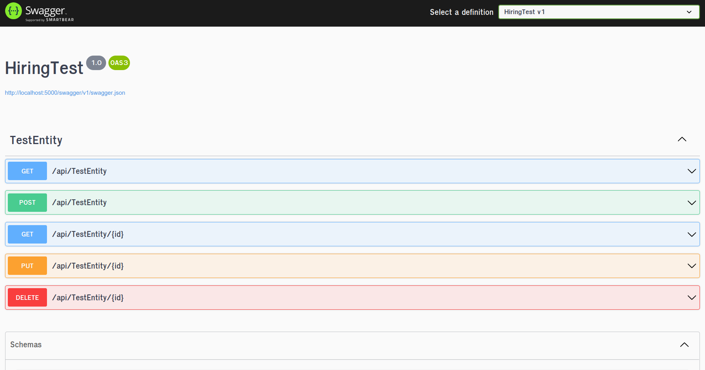

# Hiring Test Project

The test consist in a very simple CRUD App that
manages "TestEntity" objects. Being simple, is not justification
to do it the wrong way, so I made a whole infrastructure around
the API so it is easy to extend and modify. The project consist
of the following modules:

### Domain

Here lives the business models. Inside there exists an Entity
folder which serves as namespace for business entities. These are
the objects that get mapped to the Database using EntityFramework.
There is also a Models folder which owns the system inputs and outputs
(this could be called ViewModels, Commands, Dtos, or whatever).
The mapping between Entities and Models is handled by AutoMapper
and is configured in the `AddDomainMappings()` extension method
for ease of use.

### DataAccess

This namespace holds the Repository Pattern and Unit of Work pattern definition
and implementation. The idea behind Repositories is to abstract data stores
so it is easy to exchange them, use multiple of them, or mock them for testing,
without disrupting the business logic associated with data acquisition. For
this, I leverage EntityFramework and provide a Generic repository to avoid
boilerplate code from which Concrete Repositories can inherit to provide
specific data access patterns.

Unit of Work pattern is the way of achieving atomicity over a set of 
business actions (usually insert/delete/update). Most Database Systems
support the concept of Transactions and Unit of Work leverages this to
provide a higher level of cohesion on business requirements. Also, Unit of Work
serves as an entrypoint for Repositories instances, and there is a couple
of ways of implementing it. I choose to leverage the SaveChanges of 
DbContexts to join repositories together on the same transaction.

### Services

This is the Application Service Layer, where the business logic lives.
Also, I provide here an unified interface for the notification system,
and two different implementations (one to be used by the server and the other
to be used by the client Hub). The beauty of this is that Dependency Injection
allows to exchange implementations and still hold the same API, which means
that the client sending events to a listening signalR connection would feel
the same as the server pushing messages to Azure Service Bus, and both are
interchangeable.

### HiringTest

The glue of our application back-end to conform the service API. It is
automatically documented with swagger and provides the Controllers (The view part
in MVC) as entrypoints to the server. Controllers are in charge of data
manipulation and validation to feed the Service Layer and to change 
the presentation of the data (using the `Domain.Models`). Also, when
necessary, Controllers calls notification system to push events to listeners.

### HiringTest.Test

Simple demo Unit Testing for the HiringTest project. This covers the basics
of testing, it Mocks some data, Mocks the Services using DepedencyInjection
and checks the correct response from Controller and the invocation
of the notification system as a requirement.

### TestClientBlazor

This is the Client for the App. It uses Blazor Server as the hosting model.
It consist of a welcome Page, with a side menu with navigation in it. The main
view is the Test Entities link which provide a Table that display the current
entities in the App. Any changes to this collection (entity updates, additions or
removals) are tracked by this client and displayed in real-time on the table.
Also, a Toast (notification) with a warning color (Light Orange) will pop-up
when an entity is modified outside the client or with green color when a entity
is modified inside the client.

    
    

When we create a entity using the API this is what happens:

    
    

